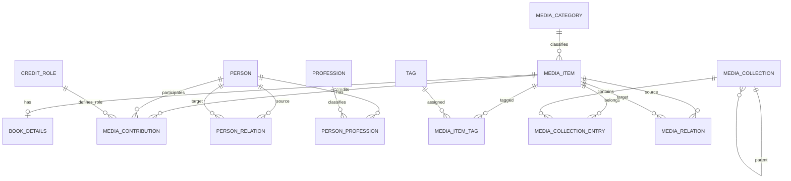

# Модель сущностей медиатеки

## Назначение

`MediaItem` хранит общие поля любого элемента медиатеки. Специфические данные вынесены в отдельные таблицы: сейчас полностью реализована таблица `BookDetails` со связью 1:1. Будущие `MovieDetails`, `GameDetails` и `MusicDetails` добавляются без расширения `MediaItems` десятками nullable-колонок.

Минимально допустимая книга содержит пользователя, название и тип `Book`. Все остальные поля необязательны. Рейтинг хранится как `decimal?`, принимает значения 0–10 с одной цифрой после десятичного разделителя и может быть удалён.

## Связи

## Основные сущности

### MediaItem и BookDetails

Обязательные поля `MediaItem`: `Id`, `UserId`, `Title`, `MediaType`, `Status`, `CreatedAt`, `UpdatedAt`. Необязательны оригинальное название, описание, категория, обложка, год выхода, рейтинг, заметки, избранное, даты начала/завершения и прогресс.

`BookDetails.MediaItemId` одновременно является PK и FK. Книжные поля включают подзаголовок, издателя, издание и его номер, годы первой публикации/издания/перевода, языки, количество страниц, ISBN-10/ISBN-13, формат, переплёт, страну и возрастное ограничение.

### Person, Profession и роли

У `Person` обязательно только отображаемое имя. Дополнительные поля описывают составное имя, псевдоним, имя сортировки, годы жизни, страну и место рождения, пол, фото, сайт, краткое описание, биографию и заметки.

Общие профессии хранятся через `Profession` и `PersonProfession`. Роль в конкретном произведении хранится отдельно через `MediaContribution` и `CreditRole`; один человек может быть писателем в целом, автором одной книги и переводчиком другой. В интерфейсе доступно редактирование профиля, нескольких профессий и связей между людьми.

### PersonRelation

Универсальная направленная связь между двумя людьми поддерживает типы spouse, partner, parent, child, sibling, relative, colleague, mentor, student, collaborator и other. Хранятся прямой и необязательный обратный тип, даты и заметки. Полей `WifeId`, `ChildrenIds` и подобных в `Person` нет.

### Теги, коллекции и отношения медиа

`Tag` и `MediaItemTag` реализуют нормализованную связь многие-ко-многим. Теги и жанры используют одну модель, но различаются `TagKind`.

`MediaCollection` образует дерево через `ParentCollectionId`. `MediaCollectionEntry` связывает элемент с коллекцией и допускает дробную позицию, например 2.5.

`MediaRelation` — направленная связь между элементами: продолжение, приквел, адаптация, ремейк, спин-офф, общая вселенная, перевод, сопутствующее произведение или другое.

## Категории и динамические схемы

`MediaCategory` поддерживает системные и пользовательские категории. Системные записи создаются идемпотентно при запуске и доступны только для чтения. Пользовательская категория принадлежит пользователю, может иметь базовый `MediaType` и схему полей в `FieldSchemaJson`.

Визуальный редактор схем поддерживает типы `text`, `multiline`, `number`, `date`, `boolean` и `choice`, обязательность поля и проверку уникальности ключей. JSON содержит только определение схемы, а не весь элемент медиатеки. Хранение значений этих динамических полей на конкретных элементах остаётся следующим расширением.

Чтобы добавить новый системный тип медиа:

1. Добавить значение `MediaType` и отдельную сущность `<Type>Details` с PK/FK `MediaItemId`.
2. Создать SQLite record и repository, зарегистрировать их в DI.
3. Добавить DTO, application service и валидацию типа.
4. Подключить типизированную секцию формы и карточку подробностей.
5. Добавить startup-миграцию и интеграционные тесты.

## Миграции и атомарность

Проект использует `sqlite-net`, а не Entity Framework. `LocalDatabaseService.InitializeAsync` расширяет схему через `CreateTableAsync`, создаёт системные категории и роли, а также идемпотентно переносит старые строковые теги, создателей, издателей и актёрский состав в нормализованные связи.

Создание и обновление полного графа выполняются внутри одной физической SQLite-транзакции `BEGIN IMMEDIATE`/`COMMIT`. Ошибка любого репозитория вызывает `ROLLBACK`, поэтому базовый элемент, книжные данные, теги, участники, коллекция и отношения не сохраняются частично. Компенсирующее удаление оставлено только как fallback для альтернативной инфраструктуры без `ITransactionRunner`.

## Реализовано

- системные и пользовательские категории, редактор динамических схем;
- дробный рейтинг 0–10, теги и жанры;
- несколько авторов, переводчиков, иллюстраторов и редакторов;
- профили людей, профессии и направленные отношения;
- `BookDetails`, издатель, коллекция и связи с другими элементами;
- создание, обновление и загрузка полного графа в одной SQLite-транзакции;
- startup-миграция прежних строковых данных;
- карточная страница подробностей, явное редактирование и рабочее избранное.

Следующие расширения: визуальное дерево коллекций, значения динамических полей на элементах, detail-таблицы остальных типов медиа и синхронизация новых таблиц с Firestore.
