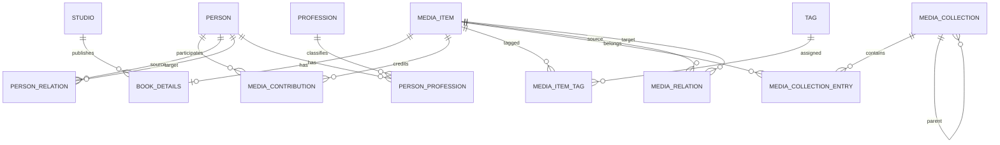

# Модель сущностей медиатеки

## Назначение и границы текущего этапа

Модель разделяет общие данные медиатеки и данные конкретного типа медиа. `MediaItem` остаётся
небольшой базовой сущностью, а книжные поля хранятся в таблице `BookDetails` со связью 1:1.
Текущий этап полностью проводит книгу через домен, SQLite, application service, DTO и MAUI-форму.
Будущие `MovieDetails`, `GameDetails`, `MusicDetails` и другие таблицы добавляются без расширения
`MediaItems` десятками nullable-колонок.

Минимально допустимая книга содержит только название, пользователя и тип `Book`. Все остальные
книжные, пользовательские и связные данные необязательны.

## ER-диаграмма

## Сущности

### MediaItem

Обязательные поля: `Id`, `UserId`, `Title`, `MediaType`, `Status`, временные метки. Для книги
`MediaType` всегда равен `Book`. Необязательные общие поля: оригинальное название, описание,
год выхода, обложка, заметки, статус, избранное, даты начала/завершения и прогресс.

`Rating` хранится как `decimal?`, допускает удаление оценки, диапазон 0–10 и одну цифру после
десятичного разделителя. Серверная валидация не принимает 7.55, отрицательные значения и значения
выше 10. UI синхронизирует ручной ввод с десятью звёздами.

Старые `Tags`, `CreatorId`, `StudioId` и таблица актёрского состава временно сохранены только для
чтения старых данных. Новый код сохраняет теги и участников через нормализованные связи.

### BookDetails

Связь 1:1 с `MediaItem`; `MediaItemId` одновременно является первичным ключом. Все книжные поля
необязательны: подзаголовок, издатель, издание и его номер, годы первой публикации/издания/перевода,
языки, страницы, ISBN-10/ISBN-13, формат, переплёт, страна и возрастное ограничение.

### Person и MediaContribution

`Person.Name` — единственное обязательное содержательное поле человека. Дополнительные поля
покрывают составное имя, псевдоним, сортировочное имя, годы и даты жизни, фото, страну, сайт,
описание и заметки.

`MediaContribution` — связь многие-ко-многим между элементом и человеком. Она хранит `CreditRoleId`,
порядок отображения, уточнение и имя в титрах. Системные `CreditRole` создаются при запуске;
enum остаётся только стабильным ключом application/UI, а не единственным хранилищем ролей. В книжной форме реализованы несколько
авторов, переводчики, иллюстраторы и редакторы; авторов можно переставлять. Поиск и создание
человека используют одну модальную панель и не создают строки с идентификаторами через запятую.

Общие профессии человека отделены от ролей в произведении сущностями `Profession` и
`PersonProfession`. Они заложены в схеме, но UI управления профессиями относится к следующему этапу.

### PersonRelation

Универсальная направленная связь человека с человеком: супруг, партнёр, родитель, ребёнок,
брат/сестра, родственник, коллега, наставник, ученик, соавтор или иная связь. Поддерживаются
обратный тип, даты, описание и временные метки. Полей `WifeId`, `ChildrenIds` и подобных нет.

### Tag и MediaItemTag

Теги и жанры хранятся одинаково нормализованно, но различаются `TagKind` (`Tag`/`Genre`). Имя
уникализируется без учёта регистра в пределах пользователя и типа. `MediaItemTag` реализует связь
многие-ко-многим. Старые строки `MediaItems.Tags` при запуске разбираются, очищаются и переносятся
в эти таблицы идемпотентно.

### MediaCollection и MediaCollectionEntry

Коллекция представляет серию, сагу, цикл, трилогию, вселенную или пользовательскую группу.
`ParentCollectionId` формирует дерево коллекций. Запись участия хранит книгу и дробную позицию;
поэтому допустимы номера вроде 2.5. В книжной форме серия ищется по имени или создаётся при
сохранении.

### MediaRelation

Направленное ребро графа между двумя элементами: продолжение, приквел, адаптация, ремейк,
спин-офф, общая вселенная, перевод, сопутствующее произведение или другое. Форма ищет существующий
элемент медиатеки и не позволяет связать книгу саму с собой или повторить одинаковую связь.

## Миграция и ограничения

Проект использует `sqlite-net`, а не Entity Framework. Поэтому схема расширяется при
`LocalDatabaseService.InitializeAsync` через `CreateTableAsync`; это является принятой в проекте
startup-миграцией. Она создаёт новые таблицы и колонки, переносит старые теги, авторов/создателей,
издателя книги и актёрский состав. Изменение affinity колонки рейтинга совместимо с существующими
целыми значениями SQLite.

Сложный граф сначала проверяется application service. При ошибке создания базовый элемент
помечается удалённым, чтобы частично созданная книга не появилась в медиатеке. Уникализация имён и
замена наборов связей выполняются репозиториями. Полноценная единая SQLite-транзакция для всех
асинхронных репозиториев остаётся отдельным инфраструктурным усилением перед облачной синхронизацией.

## Категории и расширение модели

`MediaCategory` поддерживает системные и пользовательские категории. Системные записи создаются
идемпотентно при запуске и связаны со стабильным `MediaType`; существующие элементы автоматически
получают соответствующий `CategoryId`. Пользовательская категория принадлежит пользователю, может
указывать базовый тип и в будущем задавать `FieldSchemaJson`. JSON допустим только для такой схемы
динамических метаданных; книга целиком в JSON не сохраняется. Старое строковое поле `Category`
временно сохранено как пользовательская классификация для совместимости UI.

Чтобы добавить новый системный тип:

1. добавить значение типа и отдельную сущность `<Type>Details` с PK/FK `MediaItemId`;
2. создать record/repository и зарегистрировать их в DI;
3. добавить DTO и валидатор типа;
4. подключить секцию формы по выбранному типу;
5. добавить отображение, startup-миграцию и интеграционные тесты.

## Реализовано сейчас

- системные/пользовательские категории, дробный рейтинг 0–10, теги/жанры, люди и несколько книжных участников;
- `BookDetails`, издатель, коллекция и связи с другими элементами;
- поиск/создание человека и поиск связанного элемента в форме;
- создание, обновление и загрузка полного графа книги;
- startup-миграция старых строковых тегов, создателя, издателя и актёрского состава;
- мягкое удаление базового элемента и временные метки для будущей синхронизации.

Следующие этапы: UI людей и их отношений/профессий, визуальное дерево коллекций, пользовательские
редактор динамических схем категорий, отдельные detail-таблицы других типов и включение новых таблиц в Firestore sync.
